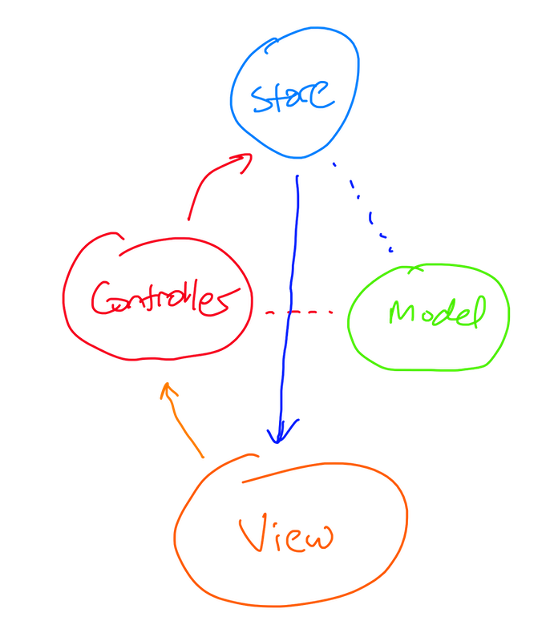

### MVCS: A Simple, Familiar, Yet Powerful Architecture

  

---

Welcome to a demo of the Model View Controller Store architecture. 

SwiftUI has never been granted a blessed architecture by Apple, and many developers have spent countless hours filling the gaps with their own ideas. The most common approach is to take the [MVVM](https://www.objc.io/issues/13-architecture/mvvm/) pattern and translate it to the needs of SwiftUI, which works well but has gaps exposed given SwiftUI's View-centric nature. Others have taken the path of integrating well thought out and powerful libraries such as [The Composable Architecture](https://github.com/pointfreeco/swift-composable-architecture) to have the tools to reason about your entire application, but come with a very high learning curve. 

Model View Controller Store brings together an architecture familiar to iOS developers, [MVC](https://developer.apple.com/library/archive/documentation/General/Conceptual/DevPedia-CocoaCore/MVC.html) and a `Store`, conventionally used in redux-like architectures. The combination of these two concepts with a simple API allows a developer to give their app a simple but well-defined state management and data architecture, with no learning curve,  and is incredibly easy to reason about. The Controller in MVCS is not a ViewController, but a lightweight object for performing operations, inspired by [Rails controllers](https://guides.rubyonrails.org/getting_started.html).

  

---

In this repo you will find a reference application built atop [Boutique](https://github.com/mergesort/Boutique), a Store that provides in-memory and disk caching. It is powered under the hood by [Bodega](https://github.com/mergesort/Bodega), an actor-based object persistence layer. The MVCS architecture does not depend on these libraries as MVCS is a pattern to follow for building a simple to reason about SwiftUI apps. But using these libraries provides you a batteries included experience with full offline support and real time state updates across your app.

What's unique about this implementation is that with only one line of code you gain powerful state management and offline persistence, no behind the scenes magic, runtime hacking, or changes to your app required. These are features that every modern SwiftUI app needs, and what's distinctive about Boutique is how integrating the library allows you to be productive in the smallest apps due to the lack of boilerplate, and scales to the biggest app due to the composable nature of MVCS.

If this sounds too good to true I recommend you play with the app yourself. The most important parts live in `App.Store`, `ImagesController`, `RedPandaCardView`, and `FavoritesCarouselView`. By exploring these types you'll see how `Store` and `@Stored` work when embedded in a `Controller`, and how they connect to SwiftUI with no more work than any other `@State` or `@ObservableObject` property. There's more code in the app which you're free to play around with, but to get the entire grasp of MVCS you only need to look in a few files.

---

You can read more about the thinking behind the architecture in this blog post exploring the [MVCS architecture](https://fabisevi.ch/fix-this), and learn more by exploring the [Boutique](https://github.com/mergesort/Boutique) and [Bodega](https://github.com/mergesort/Bodega) repos.

